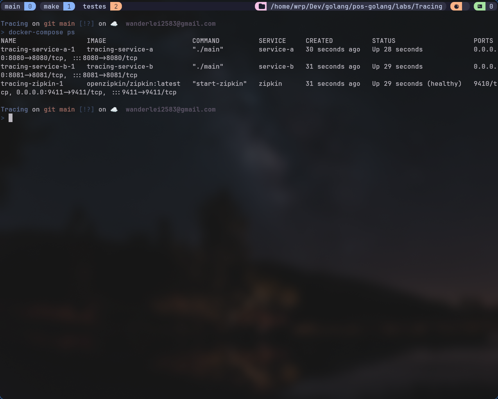
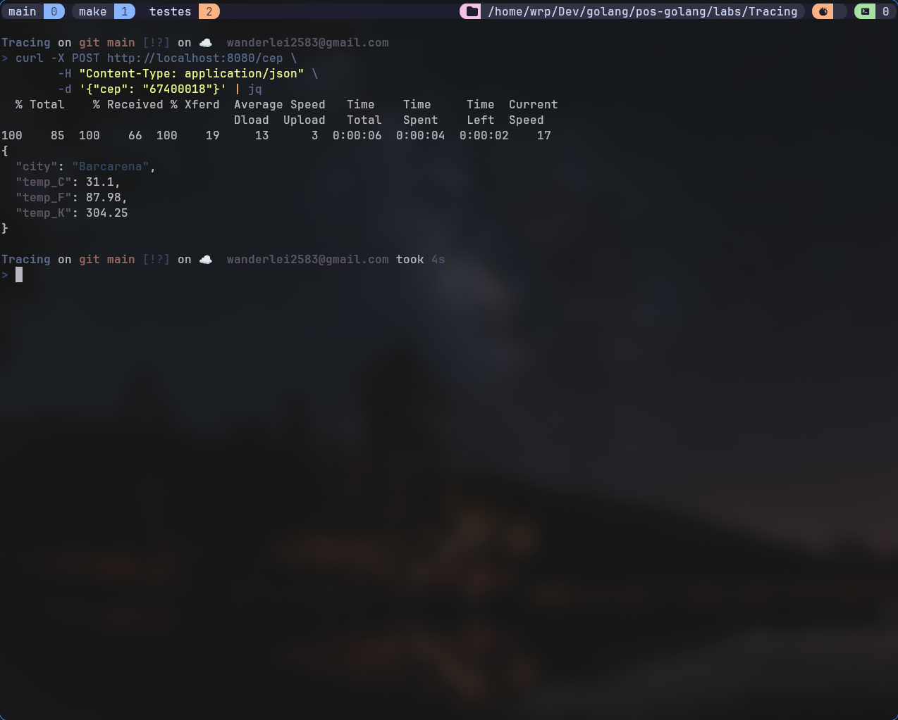
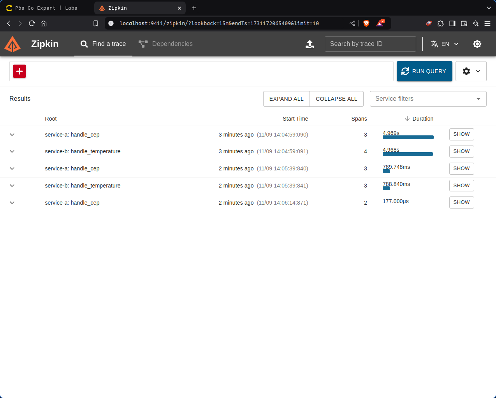

# Tracing distribuído e span

Sistema distribuído desenvolvido em Go que fornece informações de temperatura baseadas em CEP, utilizando OpenTelemetry e Zipkin para tracing distribuído.

## 🚀 Funcionalidades

- ✅ Consulta de CEP via ViaCEP
- 🌡️ Consulta de temperatura via WeatherAPI
- 🔄 Conversão automática entre escalas de temperatura (Celsius, Fahrenheit, Kelvin)
- 📊 Tracing distribuído com OpenTelemetry
- 📈 Visualização de traces via Zipkin

## 🎯 Arquitetura do Sistema

O sistema é composto por dois microserviços:

### Serviço A (Entrada)
- Recebe e valida o CEP
- Encaminha requisições para o Serviço B
- Implementa tracing para todas as requisições

### Serviço B (Processamento)
- Consulta informações do CEP (ViaCEP)
- Obtém dados de temperatura (WeatherAPI)
- Realiza conversões de temperatura
- Implementa spans para monitoramento de performance

## 📋 Pré-requisitos

- Go 1.23+
- Docker
- Docker Compose
- Chave de API do WeatherAPI ([Obter aqui](https://www.weatherapi.com/))
- Make

## 🛠️ Instalação

1. Clone o repositório
```bash
git clone https://github.com/wanderlei2583/tracing.git
cd tracing
```

2. Configure as variáveis de ambiente
```bash
cp .env.example .env
```

3. Usando o Makefile para gerenciar o projeto:

```bash
make build

make run

make stop

make clean
```

O Makefile possui os seguintes comandos disponíveis:
```makefile
build     - Constrói as imagens dos serviços
run       - Inicia todos os serviços
stop      - Para todos os serviços
clean     - Remove containers, volumes e arquivos temporários
```


## 📝 Estrutura do Projeto

```
.
├── README.md
├── .env.exemple
├── docker-compose.yml
├── Makefile
├── otel-collector-config.yaml
├── service-a
│   ├── Dockerfile
│   ├── go.mod
│   ├── main.go
│   └── internal
│       ├── handlers
│       │   └── cep_handler.go
│       └── telemetry
│           └── tracer.go
└── service-b
    ├── Dockerfile
    ├── go.mod
    ├── main.go
    └── internal
        ├── handlers
        │   └── temperature_handler.go
        ├── services
        │   ├── cep_service.go
        │   └── weather_service.go
        └── telemetry
            └── tracer.go
```

## 🔍 Uso e Exemplos

### Consultando Temperatura por CEP

```bash
curl -X POST http://localhost:8080/cep \
  -H "Content-Type: application/json" \
  -d '{"cep": "67400018"}'
```

### Respostas Possíveis

1. Sucesso (200 OK):
```json
{
    "city": "Barcarena",
    "temp_C": 31.2,
    "temp_F": 88.16,
    "temp_K": 304.34
}
```



2. CEP Inválido (422 Unprocessable Entity):
```json
{
    invalid CEP
}
```

3. CEP Não Encontrado (404 Not Found):
```json
{
    "message": "can not find zipcode"
}
```

## 📊 Monitoramento com Zipkin

1. Acesse o Zipkin UI:
```
http://localhost:9411
```

2. Visualize os traces:
- Clique em "Run Query" para ver os traces mais recentes
- Selecione um trace específico para ver os detalhes
- Analise os spans de cada serviço



## 🔑 Variáveis de Ambiente

```env
WEATHER_API_KEY=your_api_key_here
```

## ⚙️ Configurações

### OpenTelemetry Collector

O arquivo `otel-collector-config.yaml` contém as configurações do collector:

```yaml
receivers:
  otlp:
    protocols:
      grpc:
        endpoint: 0.0.0.0:4317
      http:
        endpoint: 0.0.0.0:4318

processors:
  batch:
    timeout: 1s
    send_batch_size: 1024

exporters:
  zipkin:
    endpoint: "http://zipkin:9411/api/v2/spans"
  
  debug:
    verbosity: detailed

service:
  pipelines:
    traces:
      receivers: [otlp]
      processors: [batch]
      exporters: [zipkin, debug]

  telemetry:
    logs:
      level: debug
    metrics:
      level: detailed
```

## 🐛 Solução de Problemas

### Problemas Comuns

1. Erro de conexão com WeatherAPI:
   - Verifique se a chave API está configurada corretamente
   - Confirme se há conexão com a internet

2. CEP não encontrado:
   - Verifique se o CEP está correto
   - Confirme se o serviço ViaCEP está respondendo

3. Traces não aparecem no Zipkin:
   - Confirme as configurações do OpenTelemetry

4. Erro ao iniciar os serviços:
   - Execute `make clean` e depois `make run`
   - Verifique se as portas necessárias estão disponíveis

## 📝 Licença

Este projeto está sob a licença MIT. Veja o arquivo [LICENSE](LICENSE) para mais detalhes.

## ✨ Autor

Wanderlei R Pereira - [@wanderlei2583](https://github.com/wanderlei2583)

---
